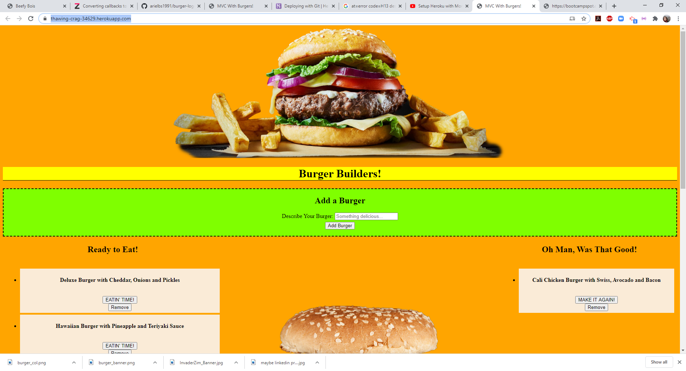
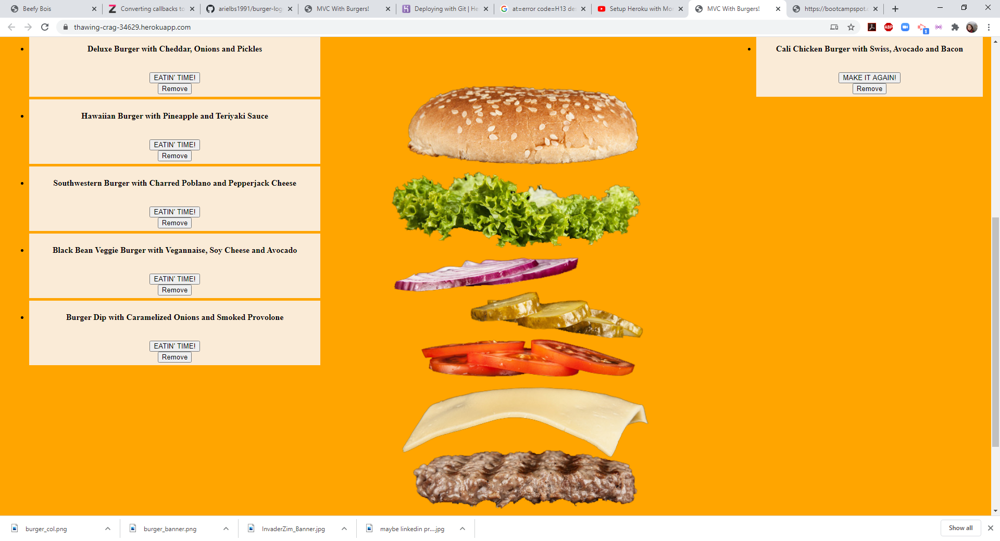

# burger-logger-hw

# Your Project Title

    burger-logger-how

    DWTFYW Public License 

## Description

    We used express, express-handlebars, and mysql to build and link together a website in which a user can enter a burger description which is saved in a mysql database. The created burgers persist, and can be modified from devoured === true to devoured === false and back, as well as deleted. We deployed the app using heroku and JAWSDB. 

## Table of Contents

    - [Installation](#installation)
    - [Usage](#usage)
    - [Credits](#credits)
    - [License](#license)
    - [Tests](#tests)

## Installation

    No steps to install, just visit https://thawing-crag-34629.herokuapp.com and play away!

## Usage 

    This webpage allows you to enter in a description of a burger, which sends it into a list of burgers titled "Ready to Eat!". From there you can click a button that says "EATIN' TIME!" to move the burger into the "Oh Man, Was That Good" column, from whence you can either "MAKE IT AGAIN!" or "Remove!" it.

## Credits

    CatApp in the week seven homework from the Bootcamp

## License and Badges

    DWTFYW Public License 

## Links and Images

    https://thawing-crag-34629.herokuapp.com/

    https://github.com/arielbs1991/burger-logger-hw

    

     

## Tests

    no built in tests in this one, we can test the database using Postman

## Questions

    If you have any questions, please reach out to me at arielbs1991@gmail.com, or find me at https://github.com/arielbs1991

    
